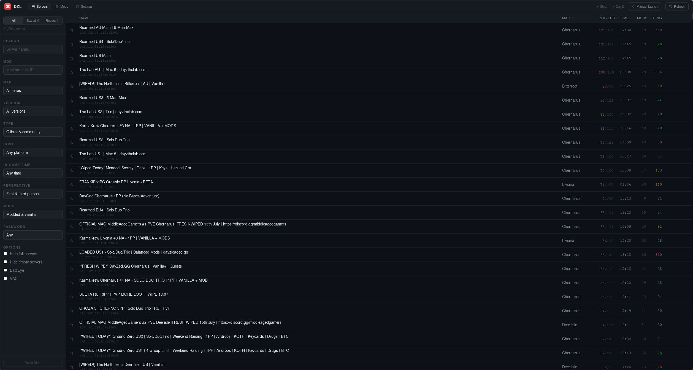
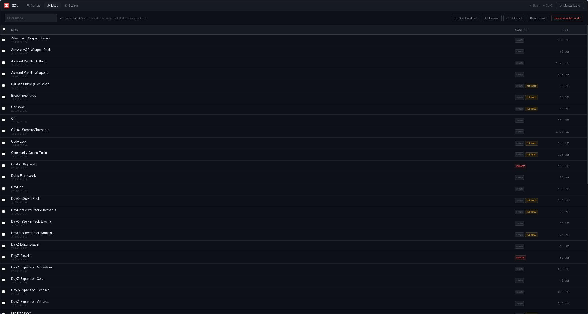
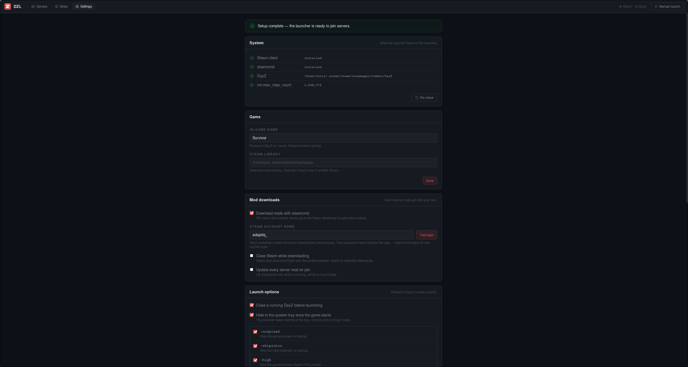

# DZL

A GUI DayZ launcher for Linux (and Windows later), built with Tauri, React and
Rust. Browse servers, install the mods a server needs, and launch the game with
the right arguments.

Inspired by [dayz-ctl](https://github.com/WoozyMasta/dayz-ctl) and
[DZSA Launcher](https://dayzsalauncher.com/).

## Screenshots



*Servers: filter 21,000 of them by name, mod, map, version, host platform,
in-game time and more, with ping and player counts queried live.*



*Mods: everything installed, how big it is, whether the launcher or a Steam
subscription put it there, and whether its symlink is intact.*



*Settings: what the launcher found on this machine, then every knob it has.*

## What it does

**Servers**
- Server list with a 5 minute cache, filtered by name, mod, map,
  version, official/community, Linux/Windows host, in-game day/night, player
  count, 1PP/3PP, BattlEye, VAC and password
- All / Saved / Recently played views; recently played servers that have gone
  offline are still listed
- Live ping, player counts and login queue queried straight from each server's
  query port (A2S), for the rows currently on screen. A full server shows how
  many people are waiting to get in
- Detail panel with per-mod install state, live player count and queue, host
  country and a BattleMetrics link

**Joining**
- Preflight that tells you exactly what is missing before anything happens
- Downloads the mods a server requires through steamcmd, with live progress,
  then symlinks them into the game directory
- Asks before closing Steam, and only when mods genuinely need downloading and
  Steam is up: steamcmd resolves `~/.steam/root` to the running client's own
  directory and writes into its `config.vdf`, which signs you out and makes
  Steam report a failed cloud sync. Steam is started again before the game
  launches. Joining a server whose mods are all present never asks
- Password servers, "update every mod first", and closing a running DayZ
- Without steamcmd it falls back to opening the Workshop pages so the Steam
  client installs the mods instead

**Mods**
- Every installed mod with its size, whether the launcher or a Steam
  subscription installed it, and whether its symlink is intact
- Checks the Steam Workshop for newer versions and flags the stale ones, with a
  count on the Mods tab, a banner, and a per-mod marker
- Multi-select update and delete, delete only launcher-installed mods, remove
  all symlinks, and relink everything

**Tray**
- Lives in the system tray; the menu shows, hides and quits the launcher
- Optionally hides itself to the tray once the game is running (off by default)
- Only one copy ever runs: starting DZL again brings the open window back
  instead of opening a second launcher

**Settings**
- System report: Steam, steamcmd, DayZ install and `vm.max_map_count`, with a
  one-click fix for the kernel limit
- Anything unfinished is called out on the page, on the section, and on the
  field itself
- Full launch-option editor (21 DayZ parameters) plus free-form arguments

**Wrappers**
- gamescope and GameMode configured in the launcher: resolution, refresh rate,
  fullscreen, borderless or windowed, force grab cursor, plus free-form
  gamescope arguments and environment variables
- Set up once, by pointing Steam's launch options for DayZ at a script the
  launcher generates. Every change after that applies on the next launch with no
  Steam restart
- Launch options already set in Steam are imported, kept as a backup, and put
  back if you remove the hook
- Because the hook lives in Steam's launch options, launching DayZ from Steam
  itself picks up the same settings

## Requirements

- Steam with DayZ installed
- `steamcmd` for automatic mod downloads
- `vm.max_map_count` ≥ 1048576 (the launcher offers to set it)
- Optional: `geoiplookup` or `whois` for server country lookup
- Optional: `gamescope` and `gamemode` for the Wrappers settings

`steamcmd` is packaged inconsistently: it is `steamcmd` from the AUR on Arch,
`steamcmd` in Debian's `non-free` and Ubuntu's `multiverse`, and not packaged at
all on Fedora, where you want
[Valve's tarball](https://developer.valvesoftware.com/wiki/SteamCMD#Linux).
It is optional either way; without it the launcher sends you to the Workshop.

### Steam sign-in

DayZ workshop content **cannot** be downloaded by steamcmd's anonymous login, so
the launcher needs a Steam account name. Your password never touches this app.
Sign in to steamcmd once in a terminal and it caches its own login token:

```sh
steamcmd +login your_account_name +quit
```

Then put the account name in Settings and hit **Test login**. If you would
rather not use steamcmd at all, turn it off in Settings and the launcher will
send you to the Steam Workshop to subscribe instead.

## Install

### Download a release

Take a `.deb`, `.rpm` or AppImage from
[Releases](https://github.com/chrisaso/DZL/releases):

```sh
sudo apt install ./DZL_0.1.1_amd64.deb          # Debian, Ubuntu
sudo dnf install ./DZL-0.1.1-1.x86_64.rpm       # Fedora
chmod +x DZL_0.1.1_amd64.AppImage && ./DZL_0.1.1_amd64.AppImage
```

Those are built on Ubuntu 22.04, so they run on glibc 2.35 and newer, meaning
Debian 12+, Ubuntu 22.04+, Fedora and Arch all qualify. Debian 11 and Ubuntu
20.04 do not, and neither ships WebKitGTK 4.1 anyway.

The `.deb` is verified on Ubuntu 26.04: it installs from the release page and
the app runs, with the tray, the server list's live queries and the
`vm.max_map_count` fix all working. Its `libgtk-3-0` dependency still resolves
there: Ubuntu's 64-bit `time_t` transition renamed the package to
`libgtk-3-0t64`, which provides the old name, so building against 22.04 for the
glibc floor costs nothing on current releases.

Building it yourself is the better route on Arch, and the one you want for
development. Only Arch is tested for *building*; the dependency sets below for
other distros are documented, not verified.

### Build dependencies

Every route needs Node, Rust, and the WebKitGTK 4.1 and GTK 3 headers.

**Arch / Manjaro** (tested)

```sh
sudo pacman -S --needed base-devel nodejs npm rust webkit2gtk-4.1 librsvg
```

**Debian 12+ / Ubuntu 22.04+**

```sh
sudo apt install build-essential curl wget file nodejs npm \
  libwebkit2gtk-4.1-dev libgtk-3-dev librsvg2-dev libxdo-dev
curl --proto '=https' --tlsv1.2 -sSf https://sh.rustup.rs | sh   # if no rustc
```

**Fedora 38+**

```sh
sudo dnf group install "C Development Tools and Libraries"
sudo dnf install nodejs npm rust cargo webkit2gtk4.1-devel gtk3-devel \
  librsvg2-devel
```

For anything else, follow the Linux section of
[Tauri's prerequisites](https://v2.tauri.app/start/prerequisites/); this is a
stock Tauri 2 app and needs nothing beyond it.

### Build and install

```sh
git clone https://github.com/chrisaso/DZL.git && cd DZL
./scripts/install.sh
```

That builds the AppImage if needed and installs into `~/.local`, with no root
and no system files touched. DZL then appears in your application menu, and `dzl`
works from a terminal if `~/.local/bin` is on your PATH.

```sh
./scripts/install.sh --binary     # install the 26 MB binary instead of the
                                  # 94 MB AppImage; uses your system WebKitGTK
./scripts/install.sh --no-build   # fail instead of building
./scripts/install.sh --uninstall  # remove it, keeping your settings
./scripts/install.sh --uninstall --purge   # remove settings too
```

`PREFIX=/some/where` installs somewhere other than `~/.local`.

Uninstalling never touches your installed mods or their symlinks.

Building needs Node and Rust; running does not. An AppImage built here still
needs WebKitGTK 4.1 and GTK 3 on the host, because GTK is deliberately not
bundled, for the reasons under [Building by hand](#building-by-hand). The release
AppImage is built on Ubuntu 22.04, where that workaround is unnecessary, so it
bundles GTK properly and is the portable one.

Off Arch, `--binary` or a native package below is the more predictable route:
the local AppImage build exists to route around linuxdeploy bugs that only bite
on a current Arch system, and it has not been exercised anywhere else.

### Let your package manager own a local build

`npm run tauri build` writes the same native packages the releases ship:

```sh
npm run tauri build
sudo apt install ./src-tauri/target/release/bundle/deb/DZL_0.1.1_amd64.deb
sudo dnf install ./src-tauri/target/release/bundle/rpm/DZL-0.1.1-1.x86_64.rpm
```

The `.deb` declares `libayatana-appindicator3-1` because that is Tauri's
default for a tray app. DZL does not actually link it, since the tray is a
[ksni](https://crates.io/crates/ksni) StatusNotifierItem over D-Bus, but you
will need the package present to satisfy `apt` regardless.

## Building by hand

The release build is a single self-contained binary, with the web UI compiled
into it, so nothing else needs to be running:

```sh
npm run tauri build                              # ~2 min
./src-tauri/target/release/dzl
```

That also writes `.deb` and `.rpm` packages to
`src-tauri/target/release/bundle/`.

For a portable single file:

```sh
npm run build:appimage
./src-tauri/target/release/bundle/appimage/dzl_0.1.1_amd64.AppImage
```

`npm run build:appimage` exists because plain `tauri build --bundles appimage`
fails on current Arch: linuxdeploy's bundled `strip` cannot read libraries with
`.relr.dyn` sections, and its GTK plugin copies a gdk-pixbuf directory that
2.44 no longer ships. The script works around both; see the comments in
`scripts/build-appimage.sh`. The trade-off is that GTK is not bundled, so the
AppImage uses the host's copy. That is fine on any machine that runs Steam,
but it is less portable than an AppImage built on an older distro.

`./scripts/install.sh` handles the desktop entry and icons for you; the steps
above are only needed if you want to place the files yourself.

### Wayland

WebKitGTK crashes at startup on a Wayland session
(`Error 71 (Protocol error)`) and renders a blank window on some GPUs, so the
app puts itself on XWayland and disables the DMA-BUF renderer before GTK
initialises.

Desktop sessions usually export a backend *priority list* like
`GDK_BACKEND=wayland,x11,*`. That is the session stating a preference, not a
demand for this app, so a list is still overridden. Otherwise the window comes
up blank when launched from the application menu. A single explicit value is
honoured, so `GDK_BACKEND=wayland dzl` does what it says.

## Development

```sh
npm install
npm run tauri dev     # run the app against the Vite dev server
npm test              # frontend tests
npm run build         # typecheck + production bundle

cd src-tauri
cargo test            # backend tests
cargo clippy --all-targets
```

`bundle.targets` in `src-tauri/tauri.conf.json` is set to `["deb", "rpm"]`
because this is Linux-first; a Windows build will need `nsis`/`msi` added.

State lives in the Tauri store (`config.json`) for settings, and in
localStorage for favourites and recently played servers. Mods this launcher
installs are marked with a `.dzl` file so cleanup never touches mods
you subscribed to in Steam.

### Cutting a release

Bump the version in `package.json`, `src-tauri/tauri.conf.json` and
`src-tauri/Cargo.toml`. All three must agree, and the one in `tauri.conf.json`
is what names the artifacts. Then tag it:

```sh
cargo update -p dzl --manifest-path src-tauri/Cargo.toml   # refresh Cargo.lock
git commit -am "chore: release v0.1.1"
git tag v0.1.1
git push origin main --follow-tags
```

`.github/workflows/release.yml` picks up any `v*` tag, runs both test suites,
builds on Ubuntu 22.04 and attaches the `.deb`, `.rpm` and AppImage to a
**draft** release. Check the AppImage starts, write the notes, then publish.

The tag has to match the manifest version or the artifact filenames will not
line up with the release.

## License

[MIT](LICENSE).
